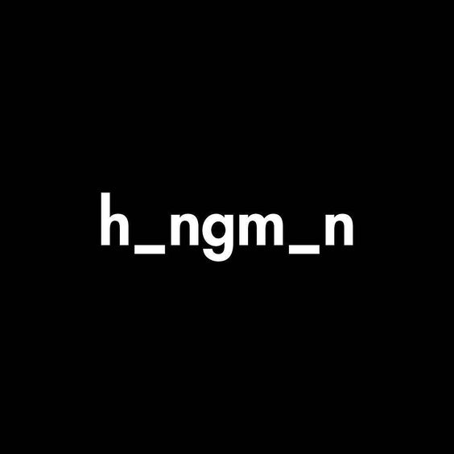

# Hangman Python Game



Welcome to Hangman, a classic word-guessing game implemented in Python! This game allows you to test your vocabulary and guessing skills while having fun. The game reads words from a `words.txt` file and provides you with a series of dashes representing the letters of a hidden word. Your task is to guess the letters and uncover the hidden word before running out of attempts.

## Getting Started

Follow these steps to play the Hangman game on your local machine:

1. **Clone the Repository:** Begin by cloning this GitHub repository to your local machine using the following command:

   ```bash
   git clone https://github.com/easyvansh/Hangman-Python-Game.git
   ```

2. **Navigate to the Directory:** Change your working directory to the cloned repository:

   ```bash
   cd hangman-python-game
   ```

3. **Run the Game:** Execute the `main.py` script to start playing the game:

   ```bash
   python main.py
   ```

## How to Play

1. Upon starting the game, you will be presented with a series of dashes, each representing a letter in the hidden word. You will also see a hint that provides a clue about the hidden word.

2. Guess a letter by entering it through the command line. If the letter is part of the hidden word, it will be revealed in its correct positions. If the letter is not part of the word, a part of the hangman drawing will be displayed.

3. You have a limited number of attempts to guess the entire word. Be cautious, as incorrect guesses will decrease your remaining attempts!

4. Continue guessing letters until you either uncover the entire word (win) or run out of attempts (lose).

5. After the game ends, you can choose to play again or exit the program.

## File Structure

The repository is organized as follows:

- `main.py`: The main Python script that runs the Hangman game.
- `words.txt`: A text file containing a list of words for the game to choose from.
- `README.md`: This README file providing instructions and information about the game.

## Customization

You can customize the game by modifying the `words.txt` file to include your own list of words. Each word should be on a separate line.


**Note:** This game was created for educational and entertainment purposes. The hangman drawing is a representation of a classic guessing game and is not intended to promote violence or harm.